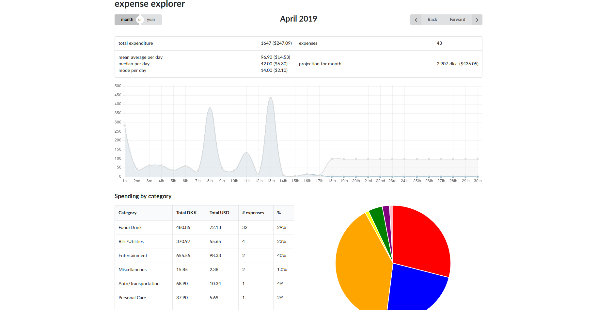

# expense-explorer

Created to better make sense of my spending.
It reads in a CSV from iExpense (mobile app), and feeds in all expenses into elasticsearch. Elastic queries are used along with some backend logic to make more actionable data, this is then rendered in a react SPA, having been served via graphQL.

Stack:
- React TS / redux
- Node TS / graphQL API / elasticsearch
- docker / docker-compose

## work on / run

- update left hand side of data volume import (`/home/sam/Dropbox/Apps/Iexpense lite:/server/importer/data`)` to contain your own export folder
	- import script assumes all CSVs in that folder are named like `ix_20190417.csv`
- `docker-compose up` to start
- `docker-compose run server yarn run import`
- browse to `http://localhost:3400` for the client, or `http://localhost:3300/graphql` to explore the API

## todo

- action type enums
- shared types
- componetization
- beautify projection UX
- single expense filter, ie. show a recurring expense over time (lunch/dinner/flights/beer/pad thai)
	- add nicely to UI
	- same for categories filter, ie. show a category over time (month/year)

bigger features (maybe later):
- filterable table of expenses
- tests..
- three prettier files could be condensed to one ideally. Need root file for editor, how to map it to each container as read only?

## usecases

- see a month by month summary of expenses
- for a single expense, see all instances of it
- summary and calendar view
- see a yearly view
- option to omit certain items from a report (like bhutan trip)